<!-- Images in assets/ are generated: edit scripts/build.mjs, then run `node scripts/build.mjs`. -->

<a href="https://resumekevin.netlify.app/">
  <picture>
    <source media="(prefers-color-scheme: dark)" srcset="assets/header-dark.svg">
    
  </picture>
</a>

  <a href="https://resumekevin.netlify.app/">Portfolio</a>
  &nbsp;&nbsp;·&nbsp;&nbsp;
  <a href="https://github.com/kevinsudhan?tab=repositories">All repositories</a>

 

### About

I'm a full-stack developer who builds **AI agents and the software around them**. Most of the work is the part that makes an agent trustworthy enough to put in front of real customers: grounding every claim in a source, guarding against promises it can't keep, and keeping a proper system of record underneath.

- **Now** — building **Araxys**: custom AI systems (agents, voice, retrieval, automation) engineered around the way a business already works.
- **Lately** — voice desks for freight forwarding and crop-insurance claims. [Araxys Desk](https://github.com/kevinsudhan/snapserve-hackathon-final) placed 3rd at Voiceathon Round 2.
- **Off the keyboard** — finance and automobiles.

 

### Selected work

  <a href="https://github.com/kevinsudhan/domain-specific-harness"><picture><source media="(prefers-color-scheme: dark)" srcset="assets/card-harness-dark.svg"></picture></a>
  <a href="https://github.com/kevinsudhan/snapserve-hackathon-final"><picture><source media="(prefers-color-scheme: dark)" srcset="assets/card-araxys-desk-dark.svg"></picture></a>
   
  <a href="https://github.com/kevinsudhan/LocalFLow"><picture><source media="(prefers-color-scheme: dark)" srcset="assets/card-localflow-dark.svg"></picture></a>
  <a href="https://github.com/kevinsudhan/research-rag-agent"><picture><source media="(prefers-color-scheme: dark)" srcset="assets/card-growth-assistant-dark.svg"></picture></a>
   
  <a href="https://github.com/kevinsudhan/Competitive-exam-cracker"><picture><source media="(prefers-color-scheme: dark)" srcset="assets/card-exam-cracker-dark.svg"></picture></a>
  <a href="https://github.com/kevinsudhan/AUTOMOMOUS-JOB-APPLICATION-AGENT-"><picture><source media="(prefers-color-scheme: dark)" srcset="assets/card-job-agent-dark.svg"></picture></a>

 

### Also built

- **[araxys-crm](https://github.com/kevinsudhan/araxys-crm)** — operations CRM for a freight forwarder, wired to a two-agent voice desk that quotes real rates and checks container space in 3D.
- **[Araxys Shipmate](https://github.com/kevinsudhan/paytm-hackathon)** — the autonomy layer beside it: commitments, a shipment digital twin, a policy gate and an audit ledger, orchestrated with n8n.
- **[Dyna Braille](https://github.com/kevinsudhan/dYnabraille)** — real-time vision that turns surroundings into dynamic tactile Braille and audio for visually impaired users.
- **[Whistle](https://github.com/kevinsudhan/whistle)** — decentralized community microfinance on Polkadot's Westend Asset Hub.
- **[med-rec](https://github.com/kevinsudhan/med-rec)** — a private, local-first health tracker I built for my grandparents.

 

### Toolkit

<picture>
  <source media="(prefers-color-scheme: dark)" srcset="assets/toolkit-dark.svg">
  
</picture>

  

<picture>
  <source media="(prefers-color-scheme: dark)" srcset="assets/footer-dark.svg">
  
</picture>
